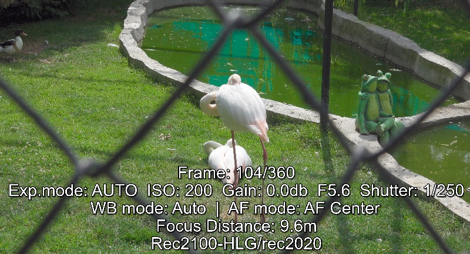

# XAVC S video real-time meta-data parser and GPS data extractor
Extract realtime meta-data (i.e. per-frame) from Sony XAVC video and render to srt subtitle file
Extract GPS data (if video shot on GPS or Bluetooth-link enabled Sony camera) and extract to GPX file.

Besides of non-realtime metadata which MediaInfo or Exiftool can see, Sony cameras record many other real-time meta-data for every frame such as it's ISO, F number, shutter speed, AE mode and even focus distance in special Acquisition Meta-data section.

Looks like this feature partially inherited by XAVC S from professional Sony XAVC codec and MXF container.

This tool tries to extract this meta-data from XAVC S (MP4) file and create SRT subtitle file near the video file. When opened in VLC or whatever, it can be viewed and you can see the settings of camera for every frame of video in real time.

Meta-data supported:
- ISO (N/A for most of camcorders and older ILCE/RX cameras)
- Gain (dB)
- Aperture value (F-number)
- Shutter speed
- Focusing distance: at what distance lens focused (for ILCE models, FDR-AX700; N/A for DSC-RX models)
- Focusing mode (Manual, Autofocus)
- Exposure mode (Auto/A/S/M)
- Capture Gamma / ColorSpace (looks like it is fixed on first frame; meta-data not changed if Picture Profile changed on camera during recording)
- recording date and time in YYYY/MM/DD HH/MM/SS format as it is set in camera settings (**output disabled yet**)
- timecode (N/A for models w/o timecode fieature; **output not implemented yet**)
- GPS coords, timestamp, speed, elevation, heading (if available)

Meta-data not supported (as no any existing consumer camera models record it):
- lens focal length, zoom position
- detailed autofocus method (spot/zone/multi e.t.c.)
- white balance value in Kelvin (probably this tag recorded in RAW-cabable video/cinema cameras, e.g. CineAlta)
- sensor readout mode and parameters (x,y resolution, dynamic range)
- built-in camera/lens color/ND filters value
- gamma curve/knee formulas/params (as these are also important for very pro video/cinema cameras)

To do:
- implement speed and heading export to GPX file (may be using Garmin GPX extensions)

Windows x64 executable available (see zip file in files list). Usage: as any console app, accepts 1 required argument (full video file path or just file name if in the same folder)
Example: **rtmd2srt.exe D:\Video\C0035.MP4**
Optional arguments:
- **-sidecar** - extract embedded XML non-realtime metadata (similar to XML sidecar recorded by camera)
- **-muxmkv** - create new MKV file with embedded subtitles stream with meta-data (requires **ffmpeg.exe** to be in same folder)
- **-gpx** - extract per-frame GPS meta-data and export to GPX file (track: latitude, longtitude, timestamp)
- **-check** - display basic file check info. Camera model, fps, framecount, if GPS meta-data embedded

Note: Works well with Sony ILCE-9/7RM3/7M3, DSC-RX10M4, FDR-AX700, ILCE-6000, ILCE-5100 videos. GPS export works well with DashWare editor

Written in: Python 3.7
Required modules:
- gpxpy
- bitstring
- argparse

Reference:
[EBU - Tech 3349 EBU Acquisition Technical Metadata Set](https://tech.ebu.ch/docs/tech/tech3349.pdf)
[Appendix (pg.70) of Sony CineAlta F65 manual](https://pro.sony/s3/cms-static-content/uploadfile/00/1237493055500.pdf)
